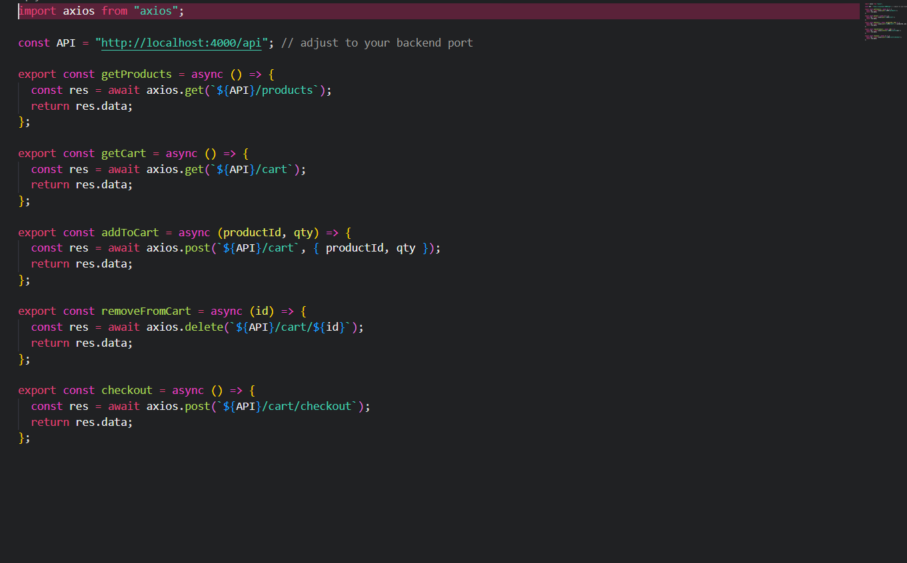
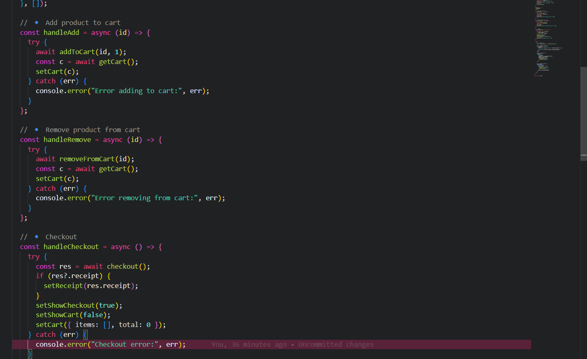
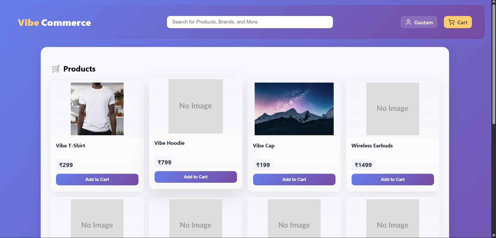
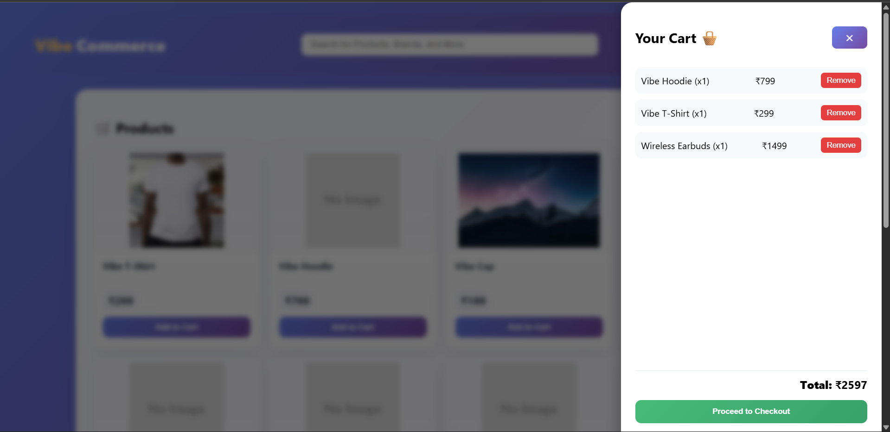

# Getting Started with Create React App

This project was bootstrapped with [Create React App](https://github.com/facebook/create-react-app).

## Available Scripts

In the project directory, you can run:

### `npm start`

Runs the app in the development mode.\
Open [http://localhost:3000](http://localhost:3000) to view it in your browser.

The page will reload when you make changes.\
You may also see any lint errors in the console.

### `npm test`

Launches the test runner in the interactive watch mode.\
See the section about [running tests](https://facebook.github.io/create-react-app/docs/running-tests) for more information.

### `npm run build`

Builds the app for production to the `build` folder.\
It correctly bundles React in production mode and optimizes the build for the best performance.

The build is minified and the filenames include the hashes.\
Your app is ready to be deployed!

See the section about [deployment](https://facebook.github.io/create-react-app/docs/deployment) for more information.

### `npm run eject`

**Note: this is a one-way operation. Once you `eject`, you can't go back!**

If you aren't satisfied with the build tool and configuration choices, you can `eject` at any time. This command will remove the single build dependency from your project.

Instead, it will copy all the configuration files and the transitive dependencies (webpack, Babel, ESLint, etc) right into your project so you have full control over them. All of the commands except `eject` will still work, but they will point to the copied scripts so you can tweak them. At this point you're on your own.

You don't have to ever use `eject`. The curated feature set is suitable for small and middle deployments, and you shouldn't feel obligated to use this feature. However we understand that this tool wouldn't be useful if you couldn't customize it when you are ready for it.

!!!!!!!!!!! This is frontend for the project!!!!!!!!!!!!!!!!!!!

setup
Git clone https://github.com/Gautam-Mahara/NexoraFrontend.git
cd ./NexoraFrontend 
npm install axios
    lucide-react react
    react-dom react-icons
    web-vitals

npm start

You are ready to go

Project overview

Api.js
this file handle all the api calling 
this have 4 main File

for adding deleting checking and checkout also for intial product grid

App.jsx 

this is heart of all project this uses lazy loading so the data can be load also all the backend services are called through it

CartView.jsx
For cart details this maps prices and objects 

ProductCard.jsx
for product card
on loading app.jsx sends backend request to /product and retrives data in productCard we map the data

ProductGrid.jsx
for grid 

Author 
Gautam Singh Mahara